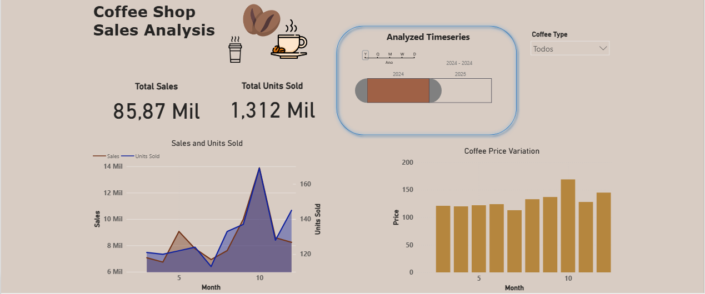

# A Coffee shop Analysis | Análise de um Café

**English:**
👉 The complete analysis with results, final remarks and recommendations is available here: [coffee_data_analysis.ipynb](coffee_data_analysis.ipynb) 

**Português:**
👉 A análise completa com resultados, considerações finais e recomendações está disponível aqui: [coffee_data_analysis.ipynb](coffee_data_analysis.ipynb)

## 📊 Dashboard Preview | Visualização do Dashboard

## 📊 Data Overview | Visão Geral dos Dados
**English:** This project analyzes comprehensive Coffee shop data including:
- **Historical information**: date and datetime including time of sales
- **Coffee type**: Coffee name and price 
- **Client information**: payment method and card number (omitted for security reasons)

**Português:** Este projeto analisa um conjunto completo de dados de um hipermercado, incluindo:
- **Informações históricas**: data e data e hora incluindo hora da venda
- **Tipo de café**: Nome e preço do café
- **Informações de cliente**: Método de pagamento e número do cartão (omitido por razões de segurança)

## ✨ Key Features | Principais Funcionalidades
- **Timeseries sales analysis and forecast** | **Análise temporal e previsão futura de vendas**
- **Interactive charts and filters with microsoft POWER BI** | **Gráficos e filtros interativos com microsoft POWER BI**
- **Coffee type behavior analysis** | **Análise do comportamento de vendas de cada café**
- **Effect of price variation on sales** | **Análise do efeito da variação do preço nas vendas**

## 🔗 Live Dashboard | Dashboard Online
**Click the link below to open the interactive dashboard in a new tab:**
**Clique no link abaixo para abrir o dashboard interativo em uma nova aba:**

🔗 <a href="https://app.powerbi.com/view?r=eyJrIjoiMTVmN2VmMDEtNTY4NC00NGE2LWI2M2MtMzE1ODRmMmIzMzMzIiwidCI6IjAyZGU0MmU3LTBjODUtNDNlNC1hYjIyLWQ4ZTM2MzJmMWE0NyJ9" target="_blank">View Interactive Dashboard on Power BI Service</a>

*Tip: Right-click → "Open in new tab"* |
*Dica: Clique com botão direito → "Abrir em nova guia"*

## 📁 Files Included | Arquivos Incluídos
- `Dashboard.pbix` - Main Power BI file | Arquivo principal do Power BI
- `coffee_shop_dashboard.png` - Dashboard screenshot | Captura de tela do dashboard
- `coffee.csv` -  Data file | Arquivo de dados
- `coffee_data_analysis.ipynb` - Jupyter notebook with complete analysis | Jupyter notebook com análise completa 

## 🚀 Getting Started | Como Usar
1. Open the Power BI Dashboard in a new tab | Abra o Dashboard do Power BI em uma nova guia
2. Start interacting with it | Comece a interagir com ele
